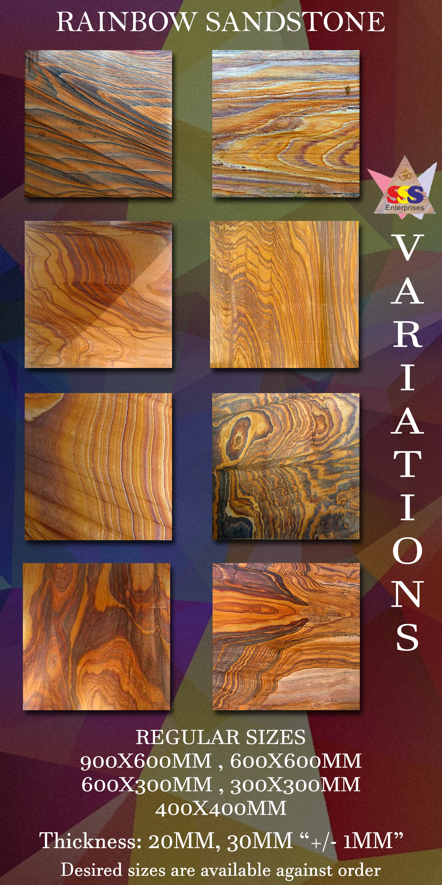
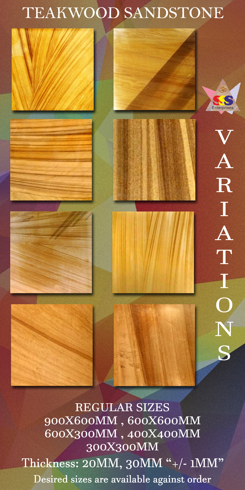
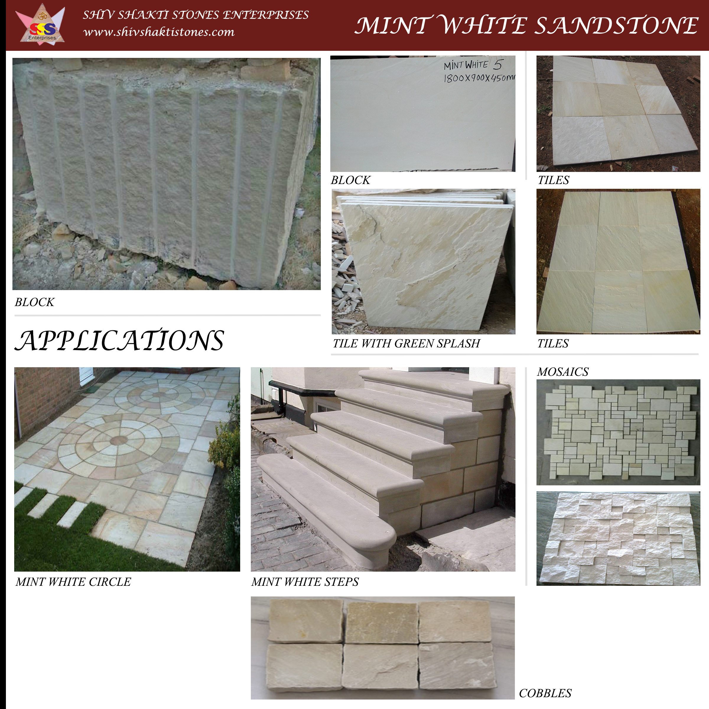
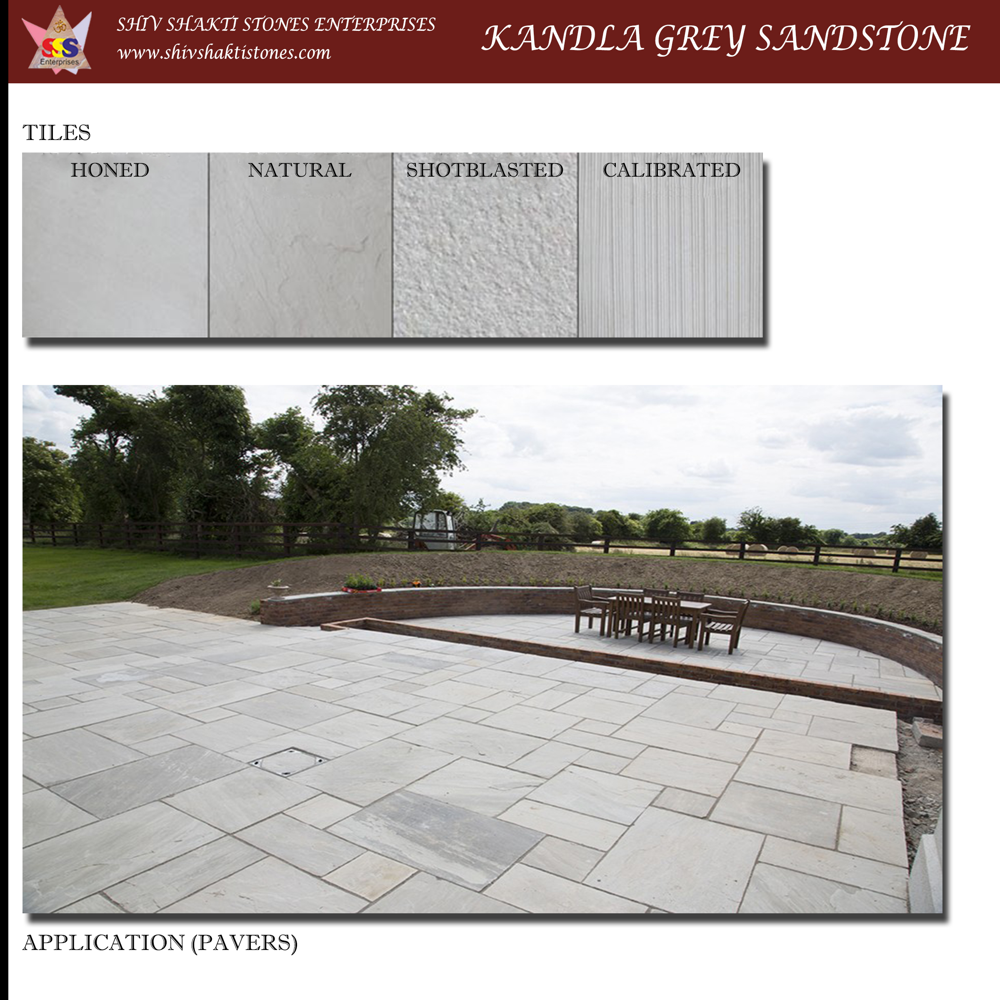
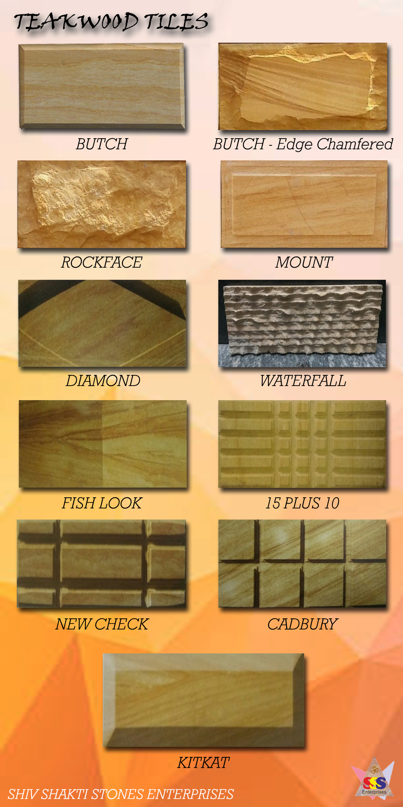

# Shiv Shakti Stones Enterprises

### *Producer, Processor and Exporter of Natural Stones*

***

#### *About Us*

Established in the year 2013, situated in **Jaipur, Rajasthan, India**, **Shiv Shakti Stones Enterprises** is started by the person with experience of over 20 years in the stone industry and is one of the growing natural stone exporting company in the country. We ensure quality and timely delivery of material to our customers spread across the globe. 
Being in trading with clients from Australia, UK, South Africa and various places across the globe, we have experience and knowledge about the export quality material and are being actively fulfilling customer's requirement on the regular basis.

#### *We Set Achievable Goals*...

**Shiv Shakti Stones Enterprises** is currently focused on establishing clients within India and overseas to firmly grip over the market. As the market is experiencing tough times and competition we are ensuring fair deal for our customers and also ensuring the growth of business that we want. 

#### *Our Vision*

##### To emerge as one of the successful stone exporter and producer in the market.

#### ***Our Products***

> Quarry Owners

##### *We are the quarry owners for Rainbow and Teakwood Sandstone, with one of the best lower ground pit material.*

We have been supplying the material to many people within the country for usage in creating artifacts and monuments due to color and presence of vibrance in the material.
The detailed image showing the various colors and structure is shown below:

*Since we deal in cut to size tiles as per container basis for the Teakwood and Rainbow Sandstone, we offer the below shown variation for both.*

##### *Beside the two of our major products we are dealing in all kind of Sandstones from Rajasthan and nearby region.*

The detailed images of our other sandstone product is shown below.

Note: We deal in all kinds of product related to these sandstones be it Cut to size tiles, natural blocks, pebbles, pavers, honed tiles, shot and sand blast tiles and artifacts.

***We are not restricting ourselves in dealing for only Sandstone, we deal in various granites and marbles of Rajasthan and nearby region, thus making us a full stacked export house.***

### *Marbles*

### *Granites*

## *Mosaics*

Beside working with natural quality sandstone, we stepped ourselves into the section of Sandstone mosaics and design tiles.
Shown below few of our products from the mosaic and tiles section. 

**Note:** The designs and quality shown above is same available in Rainbow Sandstone also.

### *Our Processing Unit*

Beside the producer of Sandstone, we are the potential processing unit of granite with the capacity to process over a lakh square feet of granite in the month. 
Our processing unit consist of 4 Multi-blade cutters (2 - Nine blade cutters and  2- Five blade cutters) and 1 Single blade cutters along with 5 hand-polisher machine making it one potential unit to process good quantity of granite.

### *Contact Us / Reach Out*

***

***Quarry Site***: No.: 53 Gram Kachras, Badi Khatu, Distt. Nagaur

***Processing Unit***: Mordi Industrial Area, Roopangarh, Distt. Ajmer
